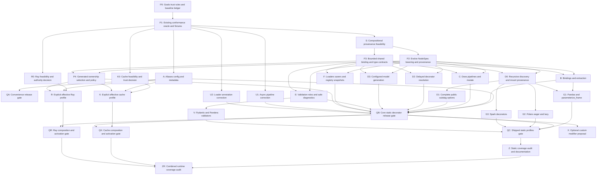

# Complete Hamilton decorator support: phased execution plan

Date: 18 September 2026. Status: implementation in progress following independent
safety and architecture reviews; see [execution record](Coverage-Execution.md).
Baseline: frontend v0.1.0 (`2ef785a`),
SDAX 0.7.2, Hamilton 1.90.0. Review dispositions are below; secondary assessments are recorded in the linked reviews.

Expand support by reusing Hamilton's decorator expansion and SDAX's execution.
Minimize additional product machinery while preserving checked bindings, ownership
and failure handling. Use **GWZ local clones, not Git worktrees**, for worker lanes.

The [inventory](Decorator-Support-Inventory.md) defines the finite shipped surface.
[Review A6a](Decorator-Support-Plan-ReviewA6a.md) addresses safety;
[Review A6b](Decorator-Support-Plan-ReviewA6b.md) addresses architecture and code size.
Both first passes reviewed plan SHA256
`ca1efd866cabaeb05309ae9bf3ca1408cb00c08d57368c2befcef99d8ab236dc`.
Their original findings remain intact. This revision changes the proposed work,
not the released package. A plan amendment is not implementation qualification.

## Mandatory goals and non-goals

P0 records these goals and every activation/release gate checks them:

- **One compiler boundary, one execution path.** Hamilton owns expansion ordering
  and generated callables. Evolve the existing private `NodeSpec` mapping rather
  than add a parallel executable graph. Retain the existing selected plan shape;
  discard temporary Hamilton/compiler state after lowering. SDAX owns scheduling,
  retries and cleanup order. Extra tasks/edges need a named semantic or lifetime reason.
- **Only necessary semantic additions.** Preserve original binding requirements,
  actual acquisition identity, known borrowing/alias relationships, policy targets
  and metadata consumed by execution/selection or documented diagnostics. Each new
  field or abstraction needs a demonstrated use case and a named consumer.
- **Bounded types and snapshots.** Extend the shared checker with the exact forms
  required by a qualified feature; no generic Python type prover, parallel type IR,
  hidden coercion or implicit `Any`. Copy a finite list of declaration/binding
  metadata containers. Preserve application value, global, closure and stateful
  instance identity except where a specific existing contract requires otherwise.
- **Trusted code versus invocation data.** Imports, annotations/type-hint evaluation,
  decorators, resolver/model/validator/adapter classes, registrations and backend
  settings are trusted application code/control inputs. Typed invocation values
  may contain untrusted data; they do not select imports, register code or activate
  persistence/remote execution. Arbitrary Python objects are not a sandbox boundary.
- **Effects and ownership remain explicit.** Invalid selected bindings fail before
  scheduled graph effects. Import-time or construction-time trusted Python may
  already have run; admission checks cannot undo it. Construction hooks that acquire
  externally owned resources are unsupported without a separate lifetime contract.
  Invoke required construction hooks once, not speculatively twice for checking.
- **Optional authority is explicit and qualified.** Cache/remote behavior is off by
  default and enabled only by trusted application configuration. Decorator metadata
  or installed plugins alone never activate it. Profiles define storage/data trust,
  retry authority, cancellation acknowledgement and enabled family combinations.
- **Data-minimal library output.** Generated reports/logging use identifiers and
  types, not config/literal/result reprs. Do not automatically persist secrets or
  log raw validator diagnostics. Preserve original user exception objects for
  programmatic inspection without promising that their contents are sanitized.
- **Minimal core and dependencies.** No Hamilton-specific SDAX core change or
  dependency is part of this plan. A demonstrated exception requires a separate
  design decision. Keep internals inside one private compatibility boundary;
  optional backend/plugin libraries load only for an explicitly selected profile.

Non-goals: sandboxing hostile Python, proving arbitrary user functions pure or
idempotent, generic deep-copy/serialization of Python object graphs, discovering
all aliases, a second scheduler/hook bus, hard termination of uncooperative work,
exactly-once distributed effects, a general secret-redaction system, persisted
plans, or a public modifier SDK designed in anticipation of unknown extensions.
A small shared implementation is preferred over a product subsystem per worker.
Necessary ownership and validation logic must not be removed merely to save lines.

## Coverage and completion

1. **QA: early convenience coverage.** Qualify aliases, configuration/exclusion and
   metadata on existing supported graph shapes. It need not wait for recursive
   ownership, plugin types or a general new representation. Existing ownership
   restrictions and all relevant safety regressions still apply.
2. **QB: built-in static decorators.** All core families, corrected async output
   pipelines and loaders, plus shared ownership/composition gates.
3. **QC/Z: all shipped static decorator profiles and audit.** Include named optional
   plugin/experimental profiles, exact imports/signatures and upstream restrictions.
   Z audits coverage and records remaining mismatches; an unrestricted declaration
   of completion requires their resolution, not just decorator-name enumeration.
4. **QK/QR/ZR: optional effective cache/remote profiles.** These are separately
   qualified runtime projects, not prerequisites for shipped static expansion.
   Metadata preservation is identified as inactive behavior when a profile is off.
   Reduced profiles and unresolved parity gaps are never called full backend support.

User-selected graph/output/override shapes are trusted application capabilities,
not an authorization service. The checked profile additionally constrains generated
validation roles as specified below. Preserve upstream unsupported-form errors and
deprecations. Record stricter frontend differences, including representation or
lifetime restrictions, in the support ledger. An unresolved required case remains
an open item; documenting it does not make it pass.

The ledger is reporting/qualification data, not a runtime interpreter or a second
admission registry. It records name/options, selected dependency profile, generated
roles, sync/async and ownership status, required tests and intentional differences.
CI-needed tables live in public shipped test inputs, not exclusively in `dev-docs`.
QA/QB/QC/Z do not publish. The existing `v*` tag workflow does publish; never push
release-looking tags as an inert qualification step.

## Dependency DAG

The [JSON DAG](decorator-support-dag.json) is the prerequisite authority. Each task
names the specific deliverable consumed from each predecessor; this diagram is
kept equivalent. Edges govern completion/integration, not permission to start tests
against provisional interfaces. K0/R0 are go/no-go feasibility gates: a failed
feasibility does not activate K/R or block static releases.

<!-- DAG_START -->

<!-- DAG_END -->

## Foundation and early path

| ID | Deliverable | Required evidence |
|---|---|---|
| P0 | Goals, trust/activation rules, baseline ledger, responsibility map and provisional contracts. | Map requirements to current NodeSpec/Selection/PreparedPlan/checker/runtime. Record bounded types/snapshot policy and control/data distinction. Do not freeze a public SDK or universal IR. |
| P1 | Evolve the existing public Hamilton/frontend oracle and fixtures. | One graph/value/error oracle; names/edges/contracts/metadata plus controlled resource assertions. Isolate modules/registrations. Add synthetic data/logging fixtures and counted construction hooks. |
| A | Alias/config/exclusion/metadata admission on current supported shapes. | Reuse shared parameterization behavior for exact reviewed aliases; do not admit arbitrary subclasses. Preserve deprecation behavior, metadata targeting and direct config predicates. Excluded helpers need not be graph-typed. No recursion/plugin types required. |
| QA | Release-readiness for A's qualified forms. | Existing direct owned parameterization, cancellation and snapshot contracts remain valid. Unsupported recursive/transformed ownership stays rejected. Run applicable safety/minimality gates below. |
| S | Small compositional provenance feasibility slice. | Demonstrate a resource-bearing parameterized subdag with projection/validation plus a counted delayed resolver. Delegate each upstream resolution operation once per actual mount/context. Prove capture without replaying Hamilton's lifecycle or inferring ownership from names. Record exactly what final nodes cannot establish. |
| P2 | Minimal evolution of existing NodeSpec lowering, based on S. | One authoritative persistent dependency mapping. Temporary records discarded. Capture only demonstrated role/origin/borrow/metadata facts; bounded metadata snapshots, and selected adapter identity. No retained FunctionGraph for ordinary execution. |
| P3 | Shared existing-type/binding contract, based on S. | Reuse `_types` and original consumer requirement sets. Define edge, default/literal and runtime representation checks. Family-specific typing additions arrive with that family's fixtures, not as a universal QA prerequisite. |
| P4 | Generated ownership/selection/policy support. | Real acquisitions own; projections borrow; known identity aliases retain origin. Selected aliases keep owners reachable. Prevent owned replacement/escape and validation-evidence bypass. SDAX tasks express lifetime order; preserve call/check separation. |
| U1 | Version-bounded async pipeline correction. | Reproduce missing return annotation; then prove awaited values, identity wrapper behavior, errors/cancellation. Guard exact versions; record removal condition. |
| U2 | Version-bounded generated loader annotation correction. | Correct raw `(data, metadata)` contract without disabling checks. Test valid/invalid loader data and projection. Guard exact versions; record removal condition. |

P1 and A can progress while S evaluates the harder composition. S confirms the
actual interception mechanism before broad interfaces freeze. A narrow wrapper on
copied modifier instances is a candidate, not a predetermined solution. If it
requires copying upstream compiler logic, record exactly what, why, alternatives
and maintenance cost for architecture review. No global monkey patches or second
pre-expansion interpreter. A failed S is a design stop for broad expansion, not a
reason to slow independently safe aliases.

P2's snapshots have a finite family-aware boundary: declaration metadata, binding
containers and explicitly supported callable references/code. Globals, closures,
identity-sensitive payloads, model/validator/adapter instances remain application
state with documented per-driver/per-invocation and reentrancy rules. Traverse
shared/cyclic declaration references with memoized identity; do not recursively
clone arbitrary objects or add generic locking to claim immutability.

## Parallel family work

Each lane owns qualification and the smallest necessary implementation delta.
Admission-only or test-only work is a valid result. Several decorators may share
one normalization path. A small private exact-class dispatch table is sufficient
unless S demonstrates otherwise. No adapter class/file per decorator is required.
The integrator owns shared orchestration; workers propose changes at narrow seams.
Files follow cohesion, not the number of lanes. X does not shape a public API now.

| ID | Scope and acceptance |
|---|---|
| B | Full admitted source/value/group/default bindings; extraction/unpack and combined parameterization. Preserve each original requirement before source merging. Raw invalid values still trigger release; projected values borrow. Add TypedDict/required-optional-field checking only where a qualified form consumes it, with positive/unsafe-neighbor tests. Upstream-invalid nested/config groups stay invalid. |
| C | Does/replacement signatures, input/output pipe steps and mutate snapshots. Qualify unaffected sync/replacement cases independently of U1; QB joins U1 for promised async output pipes. Check captured step arguments and original vs replacement contracts. Respect import-time mutation/same-module restrictions. |
| D0 | Shared recursive discovery/mount provenance capability. Recursively admit nested functions and shutdowns; identity is declaration plus mount path. Prove two mounts have independent ownership and no hidden expansion bypass. This narrow capability unlocks dataframe plugins before all subdag options. |
| D1 | Complete public subdag/parameterized_subdag options over D0: namespacing, bindings/config, selected alternatives and owned replacement protection. A owns direct config predicates. |
| D2 | Delayed resolve/resolve_from_config. Resolve once, preserve power-user opt-in and config/default requirements, recursively check the returned modifier. Its family remains disabled until separately qualified. No recursive invocation merely to inspect a result twice. |
| D3 | Configured model/dynamic_transform construction, bound compute contracts and deprecations. Define shared instance state/reentrancy; trusted constructors do not acquire untracked external resources. No universal object snapshotter. |
| E | Raw/validator/final validation graph roles, warn/fail/custom behavior, targeting and diagnostics policy below. Mandatory fail-validation survives `check_outputs=False`. No validation failure retries upstream acquisition. |
| F | Load/save factories, dataloader/datasaver and Hamilton registry protocol. Qualify unaffected savers/adapters independently of U2; QB joins U2 for affected loaders. Snapshot selected adapter identity; no second registration system. In-memory/temp-file tests need no credentials/network. |

Family implementation runs alongside P4; activation waits for P4 and QB's
composition checks. U1/U2 no longer block all C/F development. Every shared check
uses the existing checker/selection primitives. No general intersection solver,
schema inference or mandatory typing-framework dependency. Plugin schemas remain
their library's responsibility; runtime representation remains explicitly checked.

### Registry and construction policy

Before Hamilton import, conformance profiles use isolated processes and controlled
autoload configuration. Do not toggle global autoload for an individual Driver.
Preserve upstream last-applicable registration precedence. At construction, record
and retain the resolved adapter class/factory and binding provenance; do not look
it up again during execution. New registrations can affect a new Driver, never an
existing one. Test two competing synthetic registrations and mutation after build.
Package pins alone do not identify the selected registered implementation.

### Checked validation selection and diagnostics

Default checked-profile policy: generated validator evidence and raw validation
intermediates are internal, not public output/override/config-replacement targets.
Public final validated outputs remain selectable, but validation gates/evidence
cannot be replaced through ordinary overrides or config. User-declared edges that
would expose an internal raw/evidence bypass fail before graph effects. Internal
helper edges remain admitted. Any future explicit raw/bypass capability needs a
separately named weaker contract; none is required for this plan's first profile.
Record this deliberate stricter selection policy relative to Hamilton.

`check_outputs=False` disables frontend result type checks only, never Hamilton's
mandatory fail-validation. Test legal API paths involving selection, config,
overrides and downstream savers, not only deliberately broken dependency edges.
P4/E implement this jointly; V and QK inherit the same role rules.

Default validation diagnostics are data-minimal: do not delegate to upstream's
unconditional raw diagnostic logging. Prefer a narrow final-gate correction using
upstream validator results and warn/fail levels, without rewriting validators or
adding a global logging/filter framework. Emit node/validator identity and status,
not payloads. Generated validation failures use the compatible exception class
with a data-minimal message; record that diagnostic-text/logging deviation.
Preserve exceptions raised by user callbacks as original objects, which may contain
sensitive content. An explicit trusted option may request upstream raw diagnostics;
it is never inferred from tags or input data and is tested/documented separately.
Do not mutate process-global logging settings and affect concurrent Drivers.

Synthetic sentinels in config, literals, loader metadata and validator diagnostics
must be absent from automatic logs/reports in the default mode. Applications own
their own logging, custom validator side effects and deliberate raw exception
inspection. This is not generic secret discovery or sanitization of user code.

## Optional shipped plugin profiles

| ID | Deliverable and gate |
|---|---|
| G1 | Pandas with_columns plus experimental parameterize_frame; reuse D0/B. Compare column/shape/value behavior, namespacing and schema tags; qualify declared borrowing lifetimes. |
| G2 | Polars eager/lazy with_columns over D0. Keep lazy frames lazy; use named pinned optional dependency profiles. Pipelines are composition cases at QC, not a basic G2 prerequisite. |
| G3 | Spark with_columns/select/require_columns over D0. Local pinned Spark CI checks signatures, session/dataframe behavior and job cancellation boundaries. Local future cancellation does not prove Spark work stopped; prohibit placements that can release dependencies before actual stop/join. |
| V | Pydantic/Pandera validators over E. Distinguish schema-valid dict/dataframe values from nominal model instances; no implicit coercion or unsafe dict-to-model-method edge. Record representation mismatches honestly. Test selection/bypass and data-minimal diagnostics. |

All optional imports are on demand; base-only wheel tests run with those libraries
absent. The support ledger qualifies specific backend versions, not every possible
installation. A profile with unresolved unsafe combinations stays restricted and
cannot satisfy an unrestricted compatibility claim.

## Optional runtime profiles: feasibility before implementation

K0/R0 first inventory upstream components reusable without a shadow Hamilton
Driver, retained executable FunctionGraph, lifecycle hook bus, new scheduler or
core changes. Demonstrate a small admitted case and list each bridge hook, state
object, public setting and dependency. If broad lifecycle emulation is necessary,
stop that profile and request a separate architecture decision backed by evidence.
Do not use a full Hamilton executor as a hidden fallback. Static releases proceed.

### Cache: K0 → K → QK

K0 establishes storage/data trust, feasibility and exact admitted cache behaviors.
The smallest candidate uses private application-controlled storage, explicit
trusted-deserialization consent and explicit eligibility to persist a value.
Disabled is the default. Hamilton's stored results can unpickle loader metadata
even with a JSON/CSV payload: post-load type checking cannot secure those bytes.
Untrusted/shared/restored cache archives are not supported by this profile.
If they are required later, require non-executable end-to-end storage; do not
invent a restricted unpickler. Applications control directory access, retention,
security-context identity and which values are sensitive/eligible.

K must not automatically persist config, captured objects, credentials or diagnostic
payloads. Include every declared result-affecting security context, code/config and
validation version in cache identity, or disallow the sharing concerned. Owned
resources and borrowing aliases are ineligible. Loading a serialized adapter is an
I/O effect, not a free pre-check: either explicitly qualify it through F's effect
boundary or exclude that storage format. Hits must preserve required validation and
cannot silently skip authorization/validation/effect dependencies. Enumerate admitted
cache modes/formats; a reduced safe profile is not full Hamilton caching parity.

QK joins K with QB's C/E/F/P4 composition and selection contracts. Optional V or
dataframe combinations remain inactive unless QK's profile-specific cases also
pass. Test disabled behavior, deserializer/loader/validator/saver spies, tampered
and truncated entry handling, synthetic-secret nonpersistence and cross-context
isolation. Use benign fixtures, not executable malicious payloads. Report required
combination gaps explicitly; enable only the tested profile, never all registered
formats merely because metadata specifies one.

### Ray: R0 → R → QR

R0 proves a bounded dispatch bridge and exact cancellation/retry authority using
pinned local Ray and controlled fakes. Tags alone do not connect or submit. Trusted
application configuration selects the remote profile and destination; worker code,
environments and deserialization are trusted. Invocation data cannot choose them.
Sending a value explicitly grants that worker access to it. Enumerate admitted
options; reject unknown/conflicting execution, environment and retry controls
before submission, rather than forwarding arbitrary decoded options.

One layer owns attempts. Disable backend replay for SDAX-owned retries where the
pinned backend permits it; otherwise reject the effectful combination or specify
and prove the combined contract. No exactly-once promise. Cancellation completion
requires worker completion/termination for an admitted placement. Lost-worker or
partition uncertainty does not authorize a retry or dependency cleanup while work
may still use it. Prefer rejecting resource-dependent placements whose stop/join
cannot be established; document potentially unbounded draining instead of inventing
a hard timeout. G3 applies the same rule to Spark.

QR joins R with QB's C/E/F/P4 contracts and explicit rejection cases for excluded
placements. Test tags-only inactivity, approved serialization payload, option
rejection, counted attempts, late completion, missing stop acknowledgement,
repeated caller cancellation and remote failures. Fakes need pinned-backend
qualification. Optional plugin combinations activate only with corresponding QR
cases. ZR audits precisely qualified runtime profiles and remaining parity gaps;
unrestricted runtime coverage stays incomplete while required gaps remain.

X is a separate optional custom-modifier proposal after built-in mechanisms have
stabilized. It neither blocks shipped coverage nor dictates a public registry now.
F already handles custom I/O registrations through Hamilton's existing protocol.

## Shared qualification and architecture gates

At QA/QB/QC/QK/QR and their release workflow jobs require:

1. **Safety:** the applicable construction/control/data, selection, ownership,
   diagnostics, cache/remote activation and stop/join rules above have public
   regressions. Use synthetic sentinels and in-memory/temp-directory fixtures.
2. **Minimality:** record reused path, necessary delta, new fields with consumers,
   tasks/edges with reasons, dependencies, public API and upstream touchpoints.
   Admission/test-only work is valid. No duplicate executable graph or lifecycle
   engine. Keep necessary call/check separation; no arbitrary LOC quota.
3. **Compatibility boundary:** fast AST import/dependency audits confine Hamilton
   internals to the private compatibility boundary, including unexecuted branches.
   No Hamilton-specific core/API/dependency delta. Optional imports are absent in
   a base install. U1/U2 have exact version guards, attributed copied source if any,
   upstream regression and retirement/upgrade conditions; mismatch fails closed.
4. **Behavior, not test-count preservation:** retain baseline 0.1.0 guarantees.
   Replace obsolete unsupported-feature assertions with acceptance plus remaining
   negative cases when coverage expands; record those replacements. Extend one
   common oracle/module factory and role-level lifecycle suite. Do not duplicate
   every cancellation case per alias or create another testing/ledger framework.
5. **Compositions:** for the capabilities being activated, run the applicable
   compositions: extraction × parameterization; pipeline × validation;
   subdag × config/override/policy; I/O × validation; delayed resolution × returned
   modifier families. Assert generated names/edges/types/metadata and resource
   state/call counts/error identity. Negative controls must fail when required
   validation/ownership edges are deliberately removed. Compare ordinary behavior
   with Hamilton; frontend lifetime behavior needs its own explicit oracle.
6. **Reuse:** one required expansion per actual resolution context, one prepared
   processor per shape, fresh invocation state, and no replay during execution.
   Test declaration-metadata mutation and identity-sensitive application objects;
   preserve documented shallow-state/reentrancy boundaries.
7. **Packaging/release:** wheel from sdist, installed tests on Python 3.11–3.13,
   lint/typing, base-only and every claimed optional profile. Include all required
   fixtures under shipped public test inputs. No private evidence or dev-docs
   dependency. Publish only when the claimed profiles' gates are required by the
   release workflow, not merely observed in unrelated CI.

QB joins A/B/C/D1/D2/D3/E/F/P4/U1/U2. QC joins QB and G1/G2/G3/V. Z audits QC's
shipped-decorator coverage without K/R/X as hidden scope. QK/QR explicitly join
backend implementation with QB; ZR joins them and Z for the combined audit.
Every enabled optional combination adds its own composition test to the relevant
profile gate. An audit document can report gaps while the corresponding completion
status remains open; publishing the document does not close those gaps.

## Scheduling and worker ownership

Start P0, then P1. On P1's shared fixtures, run A, S, U1/U2 and K0/R0 probes in
parallel, prioritizing A/S and the pinned corrections. After S confirms the seam,
P2/P3 run in parallel; family candidates and P4 then proceed independently.
D0 unlocks plugins before D1 completes. QA can finish while recursion, plugin typing
or remote feasibility remain unresolved. C/F unaffected subsets do not wait for
U1/U2; complete QB still requires both corrected paths.

Prefer about six active editing lanes with bounded file ownership; scale read-only
review and independent tests separately. P2 owns compiler/model integration, P3
shared type primitives, P4 runtime/selection. Family authors own cohesive cases and
only necessary semantic deltas. The integrator assembles shared changes one at a
time. Do not prescribe a permanent adapter module for each worker. No calendar
promise precedes the S/K0/R0 probes. Useful early milestones need not wait for
optional profiles; unexplained prerequisite edges are removed.

## First-review dispositions

These are accepted **plan changes**, subject to the linked secondary assessments and later code/test
implementation. They do not certify the future implementation. Refer to the two
review files for original evidence and severity.

| Finding | Integrated solution and responsible gate |
|---|---|
| A6a S1 | Explicit cache deserialization/data trust, sensitive-value eligibility, context identity and hit/effect validation; K0/K/QK. |
| A6a S2 | Trusted remote activation/options, one attempt owner, uncertain stop/join rejection; R0/R/QR and G3/QC. |
| A6a S3 | Construction code/data threat boundary and counted hooks; P0/P1, A/D2/D3/F/X and activation gates. |
| A6a S4 | Upstream registry precedence with captured selected adapter identity and controlled autoload; P2/F/QB. |
| A6a S5 | Explicit internal raw/evidence and nonreplaceable validation gates, including check_outputs=False; P4/E/QB/V/QK. |
| A6a S6 | Data-minimal default generated validation diagnostics, no global logging mutation, explicit raw mode; P0/P1/E/F/V/K and gates. |
| A6b M1 | Evolve existing NodeSpec; one persistent dependency authority and SDAX execution; P0/P2/P4 and all gates. |
| A6b M2 | Counted compositional provenance slice before broad interface freeze; S before P2/P3. |
| A6b M3 | Finite metadata copy rules, identity-preserving application state and memoized traversal; P0/P2 and family cases. |
| A6b M4 | Existing bounded checker, feature-owned annotation additions and original requirement sets; P3/B/F/V. |
| A6b M5 | Lanes may add tests/admission only; shared private dispatch and upstream I/O registry; no premature public SDK. |
| A6b M6 | A/QA fast path, independent C/F subset work, D0 plugin capability checkpoint; revised DAG. |
| A6b M7 | K0/R0 go/no-go bridge probes; no runtime emulation by default; static Z separate from ZR. |
| A6b M8 | Core/dependency/import/version-boundary audit and shim retirement at each gate. |
| A6b M9 | One public oracle and role suite; replace obsolete rejections explicitly; shipped fixtures and reporting-only ledger. |

## GWZ local-clone execution procedure

Verified against installed **GWZ 1.0.14** using `local clone`, `branch`, `merge`
and `local dispose` help. Existing family lanes are `authoring`, `diagnostics`,
`evaluation`, `performance`; reserve distinct names such as `ham-compiler`,
`ham-types`, `ham-conformance`, `ham-expansion`, `ham-pipelines`, `ham-subdags`.
Check `gwz local list --json` rather than assuming names or ownership.

This build copies the **whole workspace verbatim**, including staged/unstaged
changes, untracked files and build directories. `--clean`, `--bare`, clone-time
`-b` and `--from` are parsed but refused. Family push/pull is unsupported; use
`merge --remote <lane>`. Keep the clone source quiet during each copy; provision
lanes serially, then start parallel workers. Never use Git worktrees here.

Record status and the package baseline before provisioning. The user subsequently
authorized committing all work before the initial clones; that checkpoint is
recorded in the execution record. For later work, do not reset or discard unrelated
changes to manufacture a clean workspace. Verbatim clones inherit source state:
stage/commit **only the assigned package changes**, and never publish a worker
clone directly. Commit GWZ-generated root lock/integrity updates before family
merges; this build otherwise reports publication-baseline drift. Never edit those
managed files by hand.
Verbatim copies can also contain private evidence, ignored local data and any
credentials present in the source tree. Keep destinations under equivalent access
restrictions; never upload a whole clone/archive as a public artifact or CI cache.
`dispose --keep` retains those copies. Inspect package-only diffs and distribution
contents for publication; do not publish scans of unrelated private data. Root
manifest/lock changes belong to integration and must be generated by GWZ, not hand-edited or swept into a worker commit.

Example for the expansion lane, issued from the quiet main workspace:

```sh
GWZ=/Users/owebeeone/.cargo/bin/gwz
"$GWZ" local list --json
"$GWZ" --target @root --target sdax-hamilton status --json
"$GWZ" local clone ham-expansion ../sdax-wz-ham-expansion \
  --owner codex:hamilton-decorators --wait 60
```

In that local clone, create a package branch after cloning (not via clone `-b`):

```sh
cd ../sdax-wz-ham-expansion
GWZ=/Users/owebeeone/.cargo/bin/gwz
"$GWZ" --target sdax-hamilton branch --create codex/ham-expansion --switch
"$GWZ" --target sdax-hamilton status
# Implement only this lane's assigned files; use a lane-specific external venv.
"$GWZ" --target sdax-hamilton add sdax-hamilton/src sdax-hamilton/tests
"$GWZ" --target sdax-hamilton commit -m 'Add qualified Hamilton expansion support'
```

List exact changed paths instead of the example directories if the lane contains
other pending package changes. A worker handoff includes commit ID, covered ledger
rows, tests, supported dependency profile, known failures and shared-contract changes.

Receive committed work in the integrator workspace, not by a worker pushing into it:

```sh
cd /Users/owebeeone/limbo/sdax-wz
GWZ=/Users/owebeeone/.cargo/bin/gwz
# Inspect the committed package diff first. GWZ 1.0.14 advertises --dry-run but
# refuses it for family merges; do not rely on it as an available preview.
"$GWZ" --target sdax-hamilton merge --remote ham-expansion codex/ham-expansion \
  --wait 60
"$GWZ" merge --status
"$GWZ" --target sdax-hamilton status
```

Review the merge plan before applying it. If root dirt or another coordinated
merge prevents the operation, preserve that work and resolve the specific cause;
do not expand the target or force through it. Resolve conflicts with the owning
lane, stage through GWZ and use `merge --continue`; use `merge --abort` when needed.
Refresh a worker by receiving the `root` family's package `main` branch with
`gwz --target sdax-hamilton merge --remote root main --wait 60` from the worker,
or create a fresh lane after integration. Do not use unsupported family pull/push.

Only the integrator runs the full cross-family gate and pushes selected package
changes to GitHub. Serialize family mutations and merges; `--wait` handles family
lock contention but is not permission to edit a source while it is being copied.
Use `gwz local dispose ham-expansion --keep` to detach while preserving its tree
when retirement is appropriate. Do not delete or force-dispose inherited dirty
work, or repurpose existing unrelated lanes.

These commands were checked against CLI help; no new lanes were created for this
documentation-only investigation. Provision them when starting implementation.
